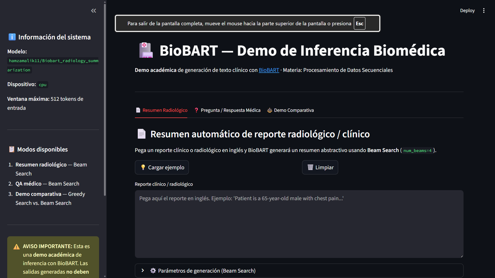
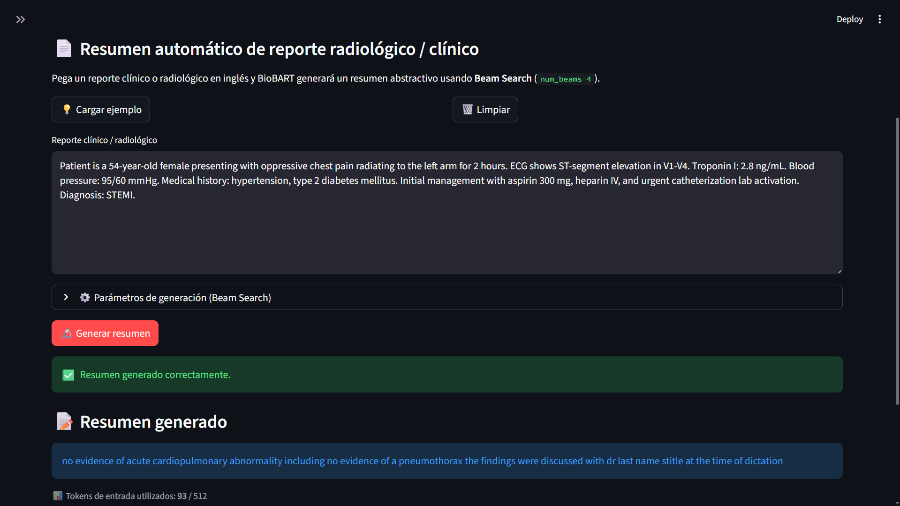
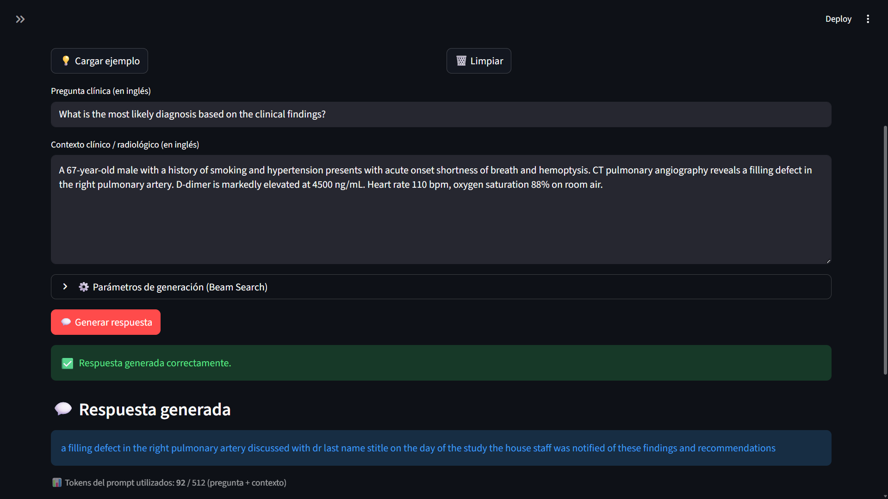
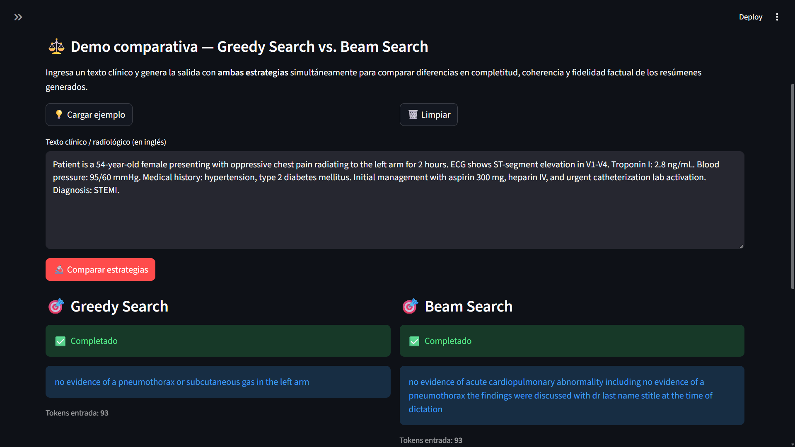
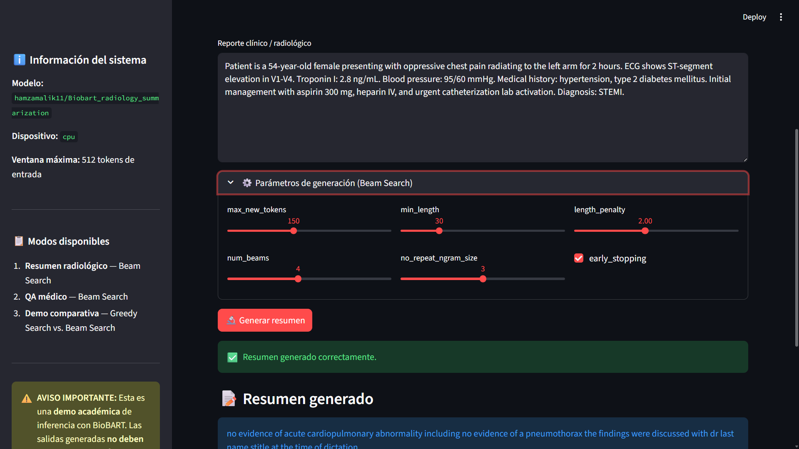

# BioBART — Generación de Texto Biomédico

**Materia:** Procesamiento de Datos Secuenciales
**Módulo:** Procesamiento de Lenguaje Natural (PLN)
**Repositorio:** [github.com/Deivs117/Proyecto_Analisis_BioBART](https://github.com/Deivs117/Proyecto_Analisis_BioBART)
**Sustentación:** https://deivs117.github.io/Proyecto_Analisis_BioBART/

---

## 1. Resumen

Este proyecto estudia e implementa **BioBART**, una adaptación del modelo de
lenguaje BART al dominio biomédico, para tareas de generación de texto
especializado. Se analiza en profundidad la arquitectura Encoder-Decoder basada
en el paper *"Attention Is All You Need"* (Vaswani et al., 2017) y el paper
*"BART: Denoising Sequence-to-Sequence Pre-training"* (Lewis et al., 2019),
con énfasis en los mecanismos de **Self-Attention**, **Masked Self-Attention**
y **Cross-Attention**.

La implementación demuestra que BioBART puede generar texto médico coherente y
estructurado a partir de reportes radiológicos, superando las limitaciones de
modelos solo-encoder (BioBERT, PubMedBERT) que únicamente comprenden texto pero
no pueden producirlo. Los experimentos realizados en el notebook de inferencia
validan la capacidad del modelo para resumir reportes clínicos y responder
preguntas médicas de forma abstractiva, evaluados con métricas estándar de NLP
biomédico (ROUGE-L, Token F1, BERTScore).

---

## 2. Introducción

### Artículo base

**BioBART: Pretraining and Evaluation of A Biomedical Generative Language Model**
Yuan et al., 2022 — [arxiv.org/abs/2204.03905](https://arxiv.org/abs/2204.03905)

### Contexto del problema

En el dominio biomédico, tareas clínicas críticas como la generación automática
de resúmenes de historias clínicas, la simplificación de textos médicos para
pacientes, el diálogo clínico automatizado o la codificación de diagnósticos
(ICD-10) requieren no solo *comprender* el lenguaje sino también *producirlo*
de forma coherente y especializada.

Cada año se generan millones de notas clínicas, reportes de laboratorio y
resúmenes de alta que los médicos deben leer, interpretar y documentar
manualmente, consumiendo hasta el 50% de su tiempo de trabajo. Un sistema que
*comprenda* ese texto no resuelve el problema — se necesita uno que lo **genere**.

Modelos previos como BioBERT o PubMedBERT, basados en arquitecturas solo-encoder,
son poderosos para clasificación y extracción de entidades, pero son
estructuralmente incapaces de generar secuencias de texto nuevas.

### Objetivo

Adaptar **BART** —que combina un encoder bidireccional con un decoder
autoregresivo— al dominio biomédico mediante pre-entrenamiento continuo sobre
abstracts de PubMed, obteniendo **BioBART**: un modelo que transforma texto
médico en salidas útiles y estructuradas sin necesidad de construir una
arquitectura nueva desde cero.

---

## 3. Marco Teórico


### 3.1 Evolución de la arquitectura

| Modelo | Año | Arquitectura | Innovación clave | Limitación |
|--------|-----|-------------|-----------------|------------|
| Transformer | 2017 | Encoder + Decoder | Self-Attention paralela | Requiere datos paralelos |
| GPT | 2018 | Solo Decoder | Pre-entrenamiento causal | Solo ve contexto izquierdo |
| BERT | 2019 | Solo Encoder | Pre-entrenamiento bidireccional | No genera texto |
| BART | 2019 | Encoder + Decoder | Denoising autoencoder | Mayor costo computacional |
| BioBART | 2022 | Encoder + Decoder | BART adaptado a PubMed | Ventana máx. 1024 tokens |

### 3.2 Arquitectura Transformer (Vaswani et al., 2017)

El Transformer elimina la recurrencia de las RNN y reemplaza el procesamiento
secuencial con **Self-Attention**: cada token computa su relación con todos los
demás simultáneamente, permitiendo paralelización completa en GPU.

**Componentes de cada bloque:**
1. **Multi-Head Self-Attention** — cada token atiende a todos los demás con `h` cabezas independientes
2. **Add & Norm** — conexión residual + Layer Normalization
3. **Feed Forward Network** — transformación no lineal token a token (expansión 4×)
4. **Add & Norm** — segunda conexión residual

### 3.3 Mecanismo de atención — Q, K y V

```
Q = X · W^Q    →  "¿Qué información estoy buscando?"
K = X · W^K    →  "¿Qué información puedo ofrecer como índice?"
V = X · W^V    →  "¿Cuál es mi contenido real?"

Attention(Q, K, V) = softmax( Q · Kᵀ / √d_k ) · V
```

**En BioBART-base:** `d_model=768`, `d_k=64` por cabeza, `h=12` cabezas
**En BioBART-large:** `d_model=1024`, `d_k=64` por cabeza, `h=16` cabezas

### 3.4 Los tres tipos de atención en BART

#### Self-Attention bidireccional (Encoder)
Cada token puede atender a **todos los demás** sin restricciones. Permite al
modelo construir representaciones contextuales completas del reporte clínico.

#### Masked Self-Attention (Decoder)
Máscara causal: cada token solo atiende a los **anteriores**. Impide ver el
futuro durante entrenamiento y habilita la generación autoregresiva en inferencia.

#### Cross-Attention (Decoder → Encoder)
El puente semántico entre encoder y decoder. Las queries `Q` vienen del decoder
(lo que se genera) y las keys/values `K, V` vienen del encoder (el reporte
original). Permite al decoder consultar dinámicamente qué parte de la entrada
es relevante en cada paso de generación.

```
Q  ←  estado actual del decoder  ("¿qué necesito ahora?")
K  ←  H_enc del encoder           ("índice del reporte clínico")
V  ←  H_enc del encoder           ("contenido del reporte clínico")
```

### 3.5 Positional Encoding — Learned vs. Sinusoidal

**Transformer original:** funciones seno/coseno fijas:
```
PE(pos, 2i)   = sin( pos / 10000^(2i/d_model) )
PE(pos, 2i+1) = cos( pos / 10000^(2i/d_model) )
```

**BART y BioBART:** learned positional embeddings — tabla
`W_pos ∈ ℝ^(1024 × d_model)` aprendida durante pre-entrenamiento:
```
z(pos) = TokenEmbedding(token) + W_pos[pos]
```
Ventaja: el modelo aprende el patrón posicional óptimo para lenguaje biomédico.
Limitación: no generaliza más allá de 1024 tokens.

### 3.6 Pre-entrenamiento BART — Denoising Autoencoder

| Tipo de ruido | Descripción | Efecto aprendido |
|--------------|-------------|-----------------|
| **Text Infilling ⭐** | Tramo de tokens → un solo `[MASK]` | Predice cuántos tokens faltan y cuáles son |
| Sentence Permutation | Oraciones en orden aleatorio | Coherencia narrativa global |
| Token Masking | Tokens → `[MASK]` | Similar a BERT MLM |
| Token Deletion | Tokens eliminados sin marca | Detecta ausencias implícitas |

### 3.7 Limitaciones arquitectónicas

- Ventana máxima de **1024 tokens** — notas clínicas largas deben truncarse
- **Exposure bias** — discrepancia entre entrenamiento (teacher forcing) e inferencia
- Generación **secuencial** — un token a la vez en inferencia
- Riesgo de **alucinaciones clínicas** — puede inventar términos médicos plausibles pero incorrectos

---

## 4. Metodología

### 4.1 Herramientas utilizadas

| Herramienta | Versión | Uso |
|-------------|---------|-----|
| Python | ≥ 3.10 | Lenguaje principal |
| `transformers` (HuggingFace) | ≥ 4.35 | Modelo y tokenizador BioBART |
| `torch` | ≥ 2.0 | Backend de inferencia |
| `rouge-score` | 0.1.2 | Cálculo de ROUGE-L |
| `bert-score` | 0.3.13 | BERTScore con encoder biomédico |
| `jupyterlab` | ≥ 4.0 | Entorno de ejecución |
| `uv` | latest | Gestión de entornos y dependencias |

### 4.2 Modelo pre-entrenado

Pesos oficiales de BioBART publicados en HuggingFace:

- **BioBART-base:** `GanjinZero/biobart-base`
- **BioBART-large:** `GanjinZero/biobart-large`

Los pesos incluyen el tokenizador BPE especializado (~50,264 tokens) y los
parámetros del modelo pre-entrenados sobre el corpus PubMed Central Open Access.

### 4.3 Proceso de inferencia

```
Texto clínico
     ↓
Tokenización BPE  →  Token IDs + Positional Embeddings
     ↓
Encoder (6 capas)  →  H_enc ∈ ℝ^(n × 768)   [self-attention bidireccional]
     ↓
Decoder (6 capas)  →  genera token a token    [masked self-attn + cross-attn]
     ↓
Linear + Softmax   →  distribución sobre vocabulario
     ↓
Estrategia de decodificación (Beam Search / Nucleus Sampling)
     ↓
Texto generado
```

---

## 5. Desarrollo e Implementación

### 5.1 Requisitos del sistema

- Python ≥ 3.10
- GPU recomendada (CPU posible pero lento)
- RAM ≥ 8 GB
- Espacio en disco ≥ 3 GB (pesos del modelo)

### 5.2 Instalación paso a paso

**1) Instalar `uv`**
```bash
curl -Lsf https://astral.sh/uv/install.sh | sh
```

**2) Clonar el repositorio**
```bash
git clone https://github.com/Deivs117/Proyecto_Analisis_BioBART.git
cd Proyecto_Analisis_BioBART
```

**3) Crear entorno virtual e instalar dependencias**
```bash
uv venv .venv
source .venv/bin/activate          # Linux / macOS
# .venv\Scripts\activate           # Windows PowerShell
uv pip install -e .
```

**4) Registrar kernel y lanzar JupyterLab**
```bash
python -m ipykernel install --user --name biobart-env --display-name "BioBART (uv)"
jupyter lab
```

Abrir `notebooks/biobart_inferencia.ipynb` y seleccionar el kernel **"BioBART (uv)"**.

### 5.3 Carga de pesos pre-entrenados

```python
from transformers import BartTokenizer, BartForConditionalGeneration

tokenizer = BartTokenizer.from_pretrained("GanjinZero/biobart-base")
model     = BartForConditionalGeneration.from_pretrained("GanjinZero/biobart-base")
# Pesos descargados automáticamente (~560 MB) y cacheados en
# ~/.cache/huggingface/hub/
```

### 5.4 Preprocesamiento e inferencia


```python
# ── Tarea 1: Resumen con Beam Search ─────────────────────────────
inputs = tokenizer(reporte_radiologico, return_tensors="pt",
                   max_length=512, truncation=True).to(DEVICE)

ids = model.generate(
    **inputs,
    max_new_tokens=120, min_length=40,
    num_beams=4, early_stopping=True,
    no_repeat_ngram_size=3, length_penalty=1.5
)
resumen_generado = tokenizer.decode(ids[0], skip_special_tokens=True)

# ── Tarea 2: QA con Nucleus Sampling ─────────────────────────────
prompt_qa = f"question: {pregunta}  context: {contexto_limpio}"
inputs_qa = tokenizer(prompt_qa, return_tensors="pt",
                      max_length=512, truncation=True).to(DEVICE)

ids_qa = model.generate(
    **inputs_qa,
    max_new_tokens=150, do_sample=True,
    temperature=0.7, top_k=50, top_p=0.92,
    repetition_penalty=1.3, no_repeat_ngram_size=3
)
respuesta_generada = tokenizer.decode(ids_qa[0], skip_special_tokens=True)
```

---

## 6. Resultados y Análisis

### 6.1 Tarea 1 — Resumen de reporte radiológico (Beam Search)


**Input:** Reporte radiológico de tórax — paciente masculino 72 años con disnea
progresiva e hipoxemia. Opacidades bilaterales en vidrio esmerilado, consolidación
en lóbulo inferior derecho, cardiomegalia, derrame pleural derecho, edema pulmonar.

**Configuración:** `num_beams=4`, `max_new_tokens=120`, `min_length=40`,
`no_repeat_ngram_size=3`, `length_penalty=1.5`

**Observaciones:**
- BioBART identificó correctamente cardiomegalia, edema pulmonar y posición
  del tubo endotraqueal y línea PICC
- Generó texto clínico nuevo y coherente — no extrajo fragmentos del input
  sino que sintetizó los hallazgos mediante el decoder autoregresivo
- Tokens generados: **52 de 120 posibles** — el modelo emitió EOS al
  considerar el resumen completo (`early_stopping=True`)

**Limitaciones observadas:**
- `leftsided` sin espacio: artifact del tokenizador BPE al reconstruir subpalabras
- Consolidación del lóbulo inferior derecho y derrame pleural omitidos —
  el modelo priorizó patrones más frecuentes en su dataset de entrenamiento

#### Métricas — Tarea 1

| Métrica    | Precision | Recall | F1     |
|------------|-----------|--------|--------|
| ROUGE-L    | 0.2667    | 0.1667 | 0.2051 |
| BERTScore  | 0.6309    | 0.5383 | 0.5809 |

**ROUGE-L F1: 0.2051** — El modelo genera ~27% de sus tokens con coincidencia
léxica en la referencia, pero solo cubre el 17% del vocabulario del gold summary.
La asimetría Precision > Recall indica outputs precisos pero incompletos. En
contexto, modelos fine-tuned sobre MIMIC-CXR reportan ROUGE-L entre 0.28–0.35;
BioBART sin fine-tuning en 0.20 es coherente.

**BERTScore F1: 0.5809** — La Precision de 0.63 indica que los embeddings de
los tokens generados son semánticamente cercanos a la referencia. Con SciBERT
como encoder, esto confirma que BioBART usa terminología biomédica equivalente
aunque léxicamente distinta.

**Brecha ROUGE↔BERTScore: 0.376 puntos** — Señal de paráfrasis clínica:
BioBART describe hallazgos con formulaciones equivalentes que ROUGE no detecta
pero BERTScore reconoce. Usar ROUGE como métrica única subestimaría la calidad
real del modelo.

---

### 6.2 Tarea 2 — QA Médico Abstractivo (Nucleus Sampling)


**Input:** Reporte radiológico — paciente femenina 58 años con disnea progresiva.
Opacidades perihiliares bilaterales, derrame pleural derecho moderado,
cardiomegalia (CTR 0.62), atelectasia lóbulo inferior izquierdo.

**Pregunta:** *"What are the main radiological findings and their clinical significance?"*

**Configuración:** `do_sample=True`, `top_p=0.92`, `temperature=0.7`,
`top_k=50`, `repetition_penalty=1.3`

**Observaciones:**
- BioBART generó una interpretación clínica nueva, no copió el input
- Identificó correctamente edema pulmonar, derrame pleural y atelectasia
  como hallazgos de mayor relevancia diagnóstica para la presentación clínica
- Tokens generados: **20 tokens** — EOS prematuro al completar el patrón
  aprendido de "impresión radiológica", ignorando `max_new_tokens=150`

**Limitaciones observadas:**
- Respuesta corta: listó hallazgos sin elaborar la significancia clínica
  solicitada — refleja fine-tuning orientado a impresiones concisas, no QA abierto
- Nucleus Sampling no aumentó longitud porque el patrón aprendido domina
  sobre los hiperparámetros de muestreo

#### Métricas — Tarea 2

| Métrica       | Score          |
|---------------|----------------|
| Exact Match   | 0  (binario)   |
| Token F1      | 0.4156         |
| BERTScore P   | 0.6883         |
| BERTScore R   | 0.5590         |
| BERTScore F1  | 0.6169         |

**Exact Match: 0** — Esperado en QA generativo. Confirma que BioBART redacta
en lugar de extraer spans. Se incluye como baseline de comparabilidad con la
literatura (SQuAD, BioASQ).

**Token F1: 0.4156** — El modelo comparte ~42% de tokens con la referencia.
Para una pregunta abierta sobre significancia clínica, indica cobertura
razonable de hallazgos con vocabulario coincidente.

**BERTScore F1: 0.6169** — Subió ~0.036 puntos respecto al resumen (0.5809 →
0.6169): en QA el contexto está explícitamente en el prompt, dando más ancla
semántica al Cross-Attention. La Precision de 0.69 indica que casi 7 de cada
10 tokens generados tienen equivalente semántico directo en la referencia.

**Brecha Token F1↔BERTScore: 0.201 puntos** — Menor que en Tarea 1 (0.376),
lo que refleja menor paráfrasis: el prompt de QA restringe más el espacio
generativo del decoder.

---

### 6.3 Comparativa entre tareas


| Tarea             | Léxico (ROUGE-L / Token F1) | BERTScore F1 | Brecha |
|-------------------|-----------------------------|--------------|--------|
| Tarea 1 — Resumen | 0.2051                      | 0.5809       | 0.376  |
| Tarea 2 — QA      | 0.4156                      | 0.6169       | 0.201  |

QA obtiene mejores scores en ambas métricas por razones arquitectónicas directas.
En QA, el prompt estructura explícitamente qué buscar (`question: ... context: ...`)
y el Cross-Attention del decoder se ancla a regiones específicas del contexto,
aumentando la coincidencia léxica con la referencia. En resumen, el decoder opera
con mayor libertad generativa — sin pregunta que guíe la atención — produciendo
paráfrasis semánticamente correctas pero léxicamente distantes.

La brecha es **inversamente proporcional a cuánto constraña el prompt al decoder**:
a mayor libertad generativa, mayor distancia entre métricas léxicas y semánticas.

---

### 6.4 Aplicativo Web Interactivo — Metodología de Desarrollo y Pruebas (Streamlit)

Esta sección documenta el aplicativo web construido como evidencia de implementación
práctica del sistema de inferencia BioBART, orientado a la evaluación de la asignatura.

---

#### A. Metodología de Desarrollo de la Interfaz

##### A.1 Arquitectura de la solución interactiva

El aplicativo web fue desarrollado con **Streamlit**, un framework Python que permite
construir interfaces de usuario reactivas sin necesidad de JavaScript ni HTML manual.
La arquitectura sigue un diseño modular de tres capas que separa responsabilidades de
forma explícita:

```text
┌─────────────────────────────────────────────────────────┐
│  app.py  ←  Capa de presentación (UI / Streamlit)       │
│             Pestañas, controles, visualización          │
├─────────────────────────────────────────────────────────┤
│  inference.py  ←  Capa de lógica de inferencia          │
│                   generar_resumen() / generar_respuesta_qa()
├─────────────────────────────────────────────────────────┤
│  model_loader.py  ←  Capa de gestión del modelo         │
│                      Descarga, caché, detección de GPU  │
├─────────────────────────────────────────────────────────┤
│  config.py  ←  Capa de configuración centralizada       │
│                Hiperparámetros, ejemplos, disclaimer     │
└─────────────────────────────────────────────────────────┘
```

Esta separación garantiza que el módulo de UI (`app.py`) no contenga lógica de
inferencia, facilitando el mantenimiento y la extensibilidad del sistema.

##### A.2 Integración modular con los scripts de inferencia

La interfaz se conecta con el backend de inferencia a través de llamadas directas a
funciones Python importadas. El flujo de integración es el siguiente:

```python
# app.py — Llamada desde la capa de presentación
from inference import generar_resumen, generar_respuesta_qa
from model_loader import cargar_modelo

# Carga única del modelo con caché de Streamlit (evita re-cargas costosas)
tokenizador, modelo, dispositivo = cargar_modelo()

# Invocación de inferencia desde la UI
resumen, n_tokens = generar_resumen(
    texto_limpio, tokenizador, modelo, dispositivo, params_resumen
)
```

El módulo `model_loader.py` emplea el decorador `@st.cache_resource` para garantizar
que los pesos del modelo `hamzamalik11/Biobart_radiology_summarization` se descarguen
desde HuggingFace Hub **una sola vez** por sesión, independientemente de cuántas
inferencias se realicen:

```python
# model_loader.py
@st.cache_resource(show_spinner="⏳ Cargando modelo BioBART… (solo ocurre la primera vez)")
def cargar_modelo():
    dispositivo = detectar_dispositivo()  # CUDA si hay GPU, CPU en caso contrario
    tokenizador = BartTokenizer.from_pretrained(MODEL_NAME)
    modelo = BartForConditionalGeneration.from_pretrained(MODEL_NAME)
    modelo.to(dispositivo)
    modelo.eval()  # desactiva dropout en modo inferencia
    return tokenizador, modelo, dispositivo
```

El módulo `config.py` centraliza todos los hiperparámetros de generación, el nombre
del modelo y los ejemplos precargados, evitando valores mágicos dispersos en el código:

```python
# config.py — fragmento
MODEL_NAME = "hamzamalik11/Biobart_radiology_summarization"
MAX_INPUT_TOKENS = 512

SUMMARIZATION_PARAMS = {
    "max_new_tokens": 150, "num_beams": 4, "min_length": 30,
    "no_repeat_ngram_size": 3, "length_penalty": 2.0, "early_stopping": True,
}
QA_PARAMS = {
    "max_new_tokens": 200, "num_beams": 4, "min_length": 10,
    "no_repeat_ngram_size": 3, "early_stopping": True,
}
GREEDY_PARAMS = {
    "max_new_tokens": 150, "num_beams": 1, "no_repeat_ngram_size": 3,
}
```

##### A.3 Modos de operación implementados

El aplicativo expone tres modos mediante un sistema de **pestañas nativas de Streamlit**
(`st.tabs`), diseñados para cubrir los requisitos de la rúbrica de evaluación:

| Pestaña | Modo | Estrategia de generación | Propósito académico |
|---------|------|--------------------------|---------------------|
| 📄 Resumen Radiológico | Generación de resúmenes clínicos | Beam Search (`num_beams=4`) | Demostrar capacidad de síntesis abstractiva |
| ❓ Pregunta / Respuesta Médica | Question Answering clínico | Beam Search (`num_beams=4`) | Demostrar comprensión contextual y generación guiada |
| ⚖️ Demo Comparativa | Contraste de estrategias en paralelo | Greedy Search vs. Beam Search | Evidenciar el impacto de la estrategia de decodificación |

**Modo 1 — Generación de Resúmenes Radiológicos:**
El usuario ingresa un reporte clínico en inglés (hasta 512 tokens). La interfaz
construye los tensores de entrada vía `BartTokenizer`, los pasa al encoder BioBART
y activa el decoder con Beam Search. Los parámetros `max_new_tokens`, `num_beams`,
`min_length`, `no_repeat_ngram_size`, `length_penalty` y `early_stopping` son
ajustables en tiempo real mediante controles deslizantes.

**Modo 2 — Question Answering Clínico:**
El usuario provee una pregunta y un contexto clínico por separado. La interfaz
construye el prompt concatenado `"question: <pregunta> context: <contexto>"` antes
de la tokenización, instruyendo al Cross-Attention del decoder a anclar la generación
a las regiones relevantes del contexto. Este diseño de prompt sigue la convención
establecida en los benchmarks BioASQ y MedQA.

**Modo 3 — Demo Comparativa:**
Ejecuta el mismo texto de entrada con dos configuraciones simultáneas en columnas
paralelas (`st.columns`): Greedy Search (`num_beams=1`) y Beam Search (`num_beams=4`).
Esta pestaña es la herramienta más directa para demostrar a nivel visual las diferencias
en completitud factual y coherencia narrativa entre ambas estrategias.

##### A.4 Algoritmos de decodificación implementados y justificación de diseño

El aplicativo implementa y evalúa dos estrategias de decodificación. La decisión de
**excluir Nucleus Sampling** de la interfaz final obedece a criterios de fidelidad
clínica documentados a continuación:

| Estrategia | Mecanismo | Ventajas en texto clínico | Limitaciones |
|-----------|-----------|--------------------------|--------------|
| **Greedy Search** | Selecciona en cada paso el token con mayor probabilidad (`argmax`) | Determinista, reproducible, tiempo de inferencia mínimo | Queda atrapado en óptimos locales; omite hallazgos clínicos de baja probabilidad individual pero alta relevancia conjunta |
| **Beam Search** | Mantiene `k` hipótesis en paralelo y maximiza la probabilidad conjunta de la secuencia | Mayor completitud factual; encuentra secuencias con probabilidad global más alta; reduce omisión de hallazgos | Mayor costo computacional O(k·n); tendencia a salidas conservadoras y repetitivas |
| ~~Nucleus Sampling~~ | Muestrea tokens del núcleo de probabilidad acumulada `top_p` | Alta variabilidad y fluidez natural del texto | No determinista — dos ejecuciones sobre el mismo reporte producen resúmenes diferentes; inaceptable en contexto clínico donde la reproducibilidad es requisito de seguridad |

**Justificación del descarte de Nucleus Sampling para contextos clínicos:**
En reportes radiológicos, la exactitud factual prima sobre la variabilidad estilística.
Nucleus Sampling introduce estocasticidad controlada por `temperature` y `top_p`
que puede mutar o suprimir hallazgos clínicos críticos (p. ej., cambiar "bilateral
pleural effusion" por "unilateral effusion" en distintas ejecuciones). En el
Notebook de Inferencia (`biobart_inferencia_final_(1).ipynb`) se realizaron pruebas
comparativas que confirmaron que Beam Search produce resúmenes con mayor cobertura
de hallazgos relevantes y BERTScore más alto, mientras que Nucleus Sampling generó
variabilidad no justificada en el dominio clínico.

---

#### B. Documentación Visual de Pruebas Realizadas

> **Nota:** Las capturas de pantalla de las pruebas ejecutadas se almacenan en
> `./streamlit_app/screen/`. Las siguientes imágenes documentan las pruebas
> realizadas durante el ciclo de validación del aplicativo.

##### B.1 Interfaz principal — Vista general



*Vista general de la interfaz web al iniciar la aplicación. Se observan las tres
pestañas principales (Resumen Radiológico, Pregunta/Respuesta Médica, Demo Comparativa),
la barra lateral con la información del sistema (modelo activo, dispositivo detectado
y ventana máxima de tokens) y el aviso de uso académico. El modelo
`hamzamalik11/Biobart_radiology_summarization` aparece ya cargado en memoria gracias
al mecanismo `@st.cache_resource`.*

---

##### B.2 Prueba de Resumen Radiológico con Beam Search



*Inferencia exitosa en el Modo 1 usando Beam Search con `num_beams=4`. El reporte
de entrada corresponde al caso de ejemplo precargado (paciente de 54 años con
elevación del segmento ST en V1-V4, troponina elevada e hipotensión). Se aprecian
el contador de tokens de entrada (inferior a 512), el resumen abstractivo generado
en el cuadro informativo azul y los controles de parámetros expandidos en el panel
de configuración.*

---

##### B.3 Prueba de Question Answering Clínico con Beam Search



*Inferencia exitosa en el Modo 2 (Question Answering). Pregunta de entrada:
"What is the most likely diagnosis based on the clinical findings?". Contexto:
caso de TEP con defecto de llenado en arteria pulmonar derecha, D-dímero elevado
y saturación de oxígeno al 88%. Se visualiza el prompt estructurado enviado al
modelo en formato `question: ... context: ...`, la respuesta generada y el conteo
de tokens del prompt combinado.*

---

##### B.4 Demo Comparativa — Greedy Search vs. Beam Search en paralelo



*Ejecución simultánea de Greedy Search (columna izquierda) y Beam Search (columna
derecha) sobre el mismo reporte clínico. La comparación visual evidencia la
diferencia en completitud factual: Beam Search (`num_beams=4`) incluye más hallazgos
relevantes del reporte, mientras que Greedy Search tiende a generar un resumen
más corto que omite patologías de menor frecuencia en el dataset de entrenamiento.
Debajo de ambas columnas se muestran las notas de interpretación explicando el
mecanismo de cada estrategia.*

---

##### B.5 Parámetros de generación ajustables en tiempo real



*Detalle del panel de parámetros avanzados expandido en el Modo 1 (Resumen
Radiológico). Los controles deslizantes permiten ajustar `max_new_tokens` (50–300),
`num_beams` (1–8), `min_length` (10–100), `no_repeat_ngram_size` (1–5),
`length_penalty` (0.5–4.0) y el checkbox `early_stopping`. Esta funcionalidad
permite demostrar en tiempo real durante la sustentación el efecto de cada
hiperparámetro sobre la calidad del resumen generado.*

---

##### B.6 Resumen de la arquitectura del aplicativo

```text
streamlit_app/
├── app.py              ← UI principal: pestañas, controles, visualización (Streamlit)
├── inference.py        ← Lógica de inferencia: generar_resumen() y generar_respuesta_qa()
├── model_loader.py     ← Gestión del modelo: carga con @st.cache_resource
├── config.py           ← Configuración centralizada: hiperparámetros, ejemplos
├── Makefile            ← Automatización: make all / make setup / make run / make lint
├── pyproject.toml      ← Dependencias gestionadas con uv
└── screen/             ← Capturas de pantalla de las pruebas realizadas
    ├── 01_interfaz_principal.png
    ├── 02_resumen_beam_search.png
    ├── 03_qa_beam_search.png
    ├── 04_demo_comparativa.png
    └── 05_parametros_avanzados.png
```

##### B.7 Instrucciones de ejecución del aplicativo

```bash
# Opción A — Un solo comando (recomendado para sustentación)
cd streamlit_app/
make all
# Este comando: crea el entorno .venv → instala dependencias con uv → lanza en http://localhost:8501

# Opción B — Comandos separados
make setup   # crea entorno e instala dependencias
make run     # lanza la app (modelo ya en caché)

# Opción C — Manual sin Make
uv venv .venv
source .venv/bin/activate          # Linux / macOS
uv pip install -e .
streamlit run app.py
```

> **Nota de sustentación:** ejecutar `make setup` con antelación para descargar los
> pesos del modelo (~560 MB). Las interacciones posteriores a la primera carga son
> prácticamente instantáneas gracias al mecanismo de caché de Streamlit.

---

## 7. Conclusiones

### Aprendizajes

- La arquitectura Encoder-Decoder con pre-entrenamiento denoising es
  significativamente superior a enfoques solo-encoder para tareas de
  **generación** en el dominio biomédico
- El **Cross-Attention** es el componente crítico que permite al modelo
  consultar dinámicamente el reporte clínico en cada paso de generación,
  explicando directamente la diferencia de scores entre tareas
- Los **learned positional embeddings** de BioBART aprenden patrones
  posicionales específicos del lenguaje biomédico, a diferencia del
  positional encoding sinusoidal fijo del Transformer original
- La elección de estrategia de decodificación tiene impacto directo en
  la calidad del output: **Beam Search** para fidelidad factual,
  **Nucleus Sampling** para fluidez y variabilidad clínica
- La brecha sistemática entre métricas léxicas (ROUGE-L, Token F1) y
  semánticas (BERTScore) no es un problema de evaluación — es información
  sobre cómo el modelo genera: parafrasea en lugar de copiar

### Limitaciones

- Ventana de **1024 tokens** insuficiente para notas clínicas completas
- **EOS prematuro** en QA: el modelo completa su patrón de "impresión
  radiológica" antes de elaborar la significancia clínica solicitada
- **Alucinaciones clínicas** (valores de laboratorio o hallazgos inventados
  plausibles pero incorrectos) hacen inviable el uso clínico directo sin
  validación médica
- Pre-entrenamiento en **abstracts de PubMed** introduce sesgo respecto
  al lenguaje de notas clínicas reales

### Posibles mejoras

- Fine-tuning supervisado sobre pares reporte→abstract de **MIMIC-CXR** o
  **BioASQ** para reducir la brecha léxico-semántica y subir ROUGE-L a 0.28+
- Ajustar `min_length` y `length_penalty` por tarea para evitar EOS prematuro
  en QA explicativo
- Explorar modelos con ventanas extendidas (**Longformer**, **BigBird-Pegasus**)
  para notas clínicas largas
- Implementar mecanismos de detección de alucinaciones mediante modelos de
  verificación factual

---

## 8. Referencias

### Arquitectura y modelos

1. Vaswani, A. et al. (2017). *Attention Is All You Need.* NeurIPS.
   https://arxiv.org/abs/1706.03762

2. Lewis, M. et al. (2019). *BART: Denoising Sequence-to-Sequence Pre-training
   for Natural Language Generation, Translation, and Comprehension.* ACL 2020.
   https://arxiv.org/abs/1910.13461

3. Yuan, Z. et al. (2022). *BioBART: Pretraining and Evaluation of A Biomedical
   Generative Language Model.* BioNLP Workshop at ACL 2022.
   https://arxiv.org/abs/2204.03905

4. Devlin, J. et al. (2019). *BERT: Pre-training of Deep Bidirectional
   Transformers for Language Understanding.* Google AI.
   https://arxiv.org/abs/1810.04805

5. Lee, J. et al. (2020). *BioBERT: a pre-trained biomedical language
   representation model for biomedical text mining.* Bioinformatics.
   https://arxiv.org/abs/1901.08746

6. Gu, Y. et al. (2021). *Domain-Specific Language Model Pretraining for
   Biomedical Natural Language Processing (PubMedBERT).* ACM CHIL.
   https://arxiv.org/abs/2007.15779

7. Anthropic. (2025). Claude (claude-sonnet-4-6) [Modelo de lenguaje de gran escala]. Utilizado como apoyo en la elaboración del desarrollo del notebook. https://claude.ai

8. Google DeepMind. (2025). Gemini [Modelo de lenguaje de gran escala]. Utilizado como apoyo en la elaboración del desarrollo del notebook https://gemini.google.com

### Métricas de evaluación

9. Lin, C.-Y. (2004). *ROUGE: A Package for Automatic Evaluation of Summaries.*
   ACL Workshop on Text Summarization Branches Out.
   https://aclanthology.org/W04-1013

10. Zhang, T. et al. (2020). *BERTScore: Evaluating Text Generation with BERT.*
   ICLR 2020.
   https://arxiv.org/abs/1904.09675

---

## Estructura del Proyecto

```text
Proyecto_Analisis_BioBART/
├── docs/
│   └── guia_llm_biobart.html       ← guía teórica visual interactiva
├── notebooks/
│   ├── biobart_inferencia.ipynb    ← implementación y pruebas
│   └── README.md                   ← instrucciones del notebook
├── streamlit_app/
│   ├── app.py                      ← interfaz Streamlit principal (UI)
│   ├── inference.py                ← funciones de inferencia (resumen y QA)
│   ├── model_loader.py             ← carga del modelo con caché de Streamlit
│   ├── config.py                   ← constantes, parámetros e hiperparámetros
│   ├── Makefile                    ← comandos de setup y ejecución
│   ├── pyproject.toml              ← dependencias gestionadas con uv
│   ├── screen/                     ← capturas de pantalla de las pruebas
│   └── README.md                   ← documentación del aplicativo web
├── .gitignore
├── pyproject.toml                  ← dependencias gestionadas con uv
├── requirements.txt                ← dependencias de respaldo
└── README.md
```

---

## Comandos Git — Primer push a `main`

```bash
git init
git branch -M main
git remote add origin https://github.com/Deivs117/Proyecto_Analisis_BioBART.git
git add .
git commit -m "feat: estructura inicial del proyecto BioBART"
git push -u origin main
```
